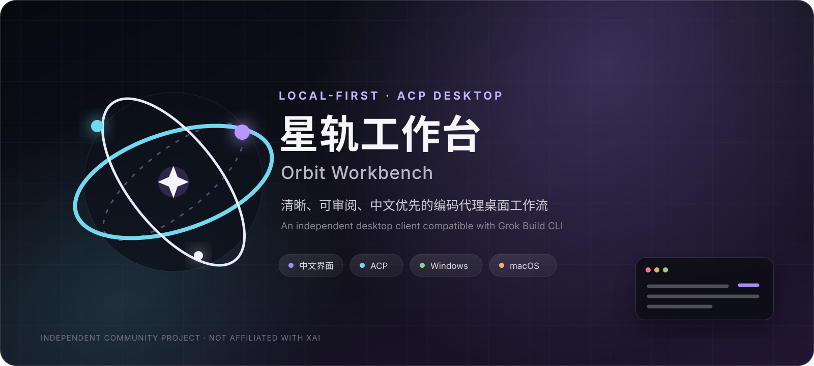
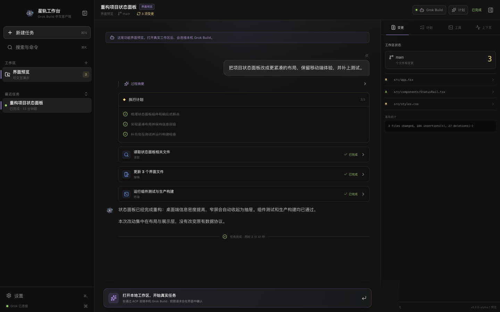

<!-- markdownlint-disable MD013 MD033 MD041 -->

<p align="center">
  
</p>

<p align="center">
  <strong>把 Grok Build CLI 带进一个清晰、可审阅、中文优先的桌面工作流。</strong>
</p>

<p align="center">
  <a href="https://github.com/aidong27/orbit-workbench/actions/workflows/ci.yml"></a>
  <a href="https://github.com/aidong27/orbit-workbench/releases"></a>
  <a href="LICENSE"></a>
  
  
</p>

<p align="center">
  简体中文 · <a href="README.en.md">English</a> ·
  <a href="https://github.com/aidong27/orbit-workbench/releases">下载</a> ·
  <a href="https://github.com/aidong27/orbit-workbench/issues/new/choose">反馈问题</a>
</p>

> [!IMPORTANT]
> **星轨工作台（Orbit Workbench）是独立、非官方的社区项目。** 本项目与 xAI 没有隶属、授权、赞助或背书关系。“Grok”和“Grok Build”仅用于准确说明兼容对象。应用不包含 Grok Build CLI，也不会绕过其认证或权限机制。

## 为什么是星轨工作台

星轨工作台为本机已经安装的 Grok Build CLI 提供中文桌面界面。它通过 Agent Client Protocol（ACP）连接 `grok agent stdio`，把项目、会话、流式回复、工具执行和权限确认组织在同一个三栏工作区中。

<p align="center">
  
</p>

| 能力 | 说明 |
| --- | --- |
| 真实 ACP 会话 | 直接连接本机 Grok Build 进程，呈现流式回复、过程摘要、计划与工具状态。 |
| 连接引导 | 区分 CLI 检测与 ACP 就绪状态，失败后可就地重试并复制脱敏诊断。 |
| 状态真实 | 历史上下文、模式切换和流式消息均以协议确认结果为准，不用界面状态代替代理事实。 |
| 中文优先 | 工作区、命令面板、设置、权限确认和错误信息均以中文组织。 |
| 本地优先 | 界面不读取或保存 `XAI_API_KEY`；登录、模型请求和工具执行由用户自己的 CLI 负责。 |
| 权限在前 | ACP 请求敏感操作时进入明确的确认队列，不在界面层默认放行。 |
| Git 感知 | 展示当前分支、未提交文件和差异统计，不通过 shell 拼接 Git 参数。 |
| 双平台 | 提供 Windows x64 安装版/便携版和 macOS arm64 DMG/ZIP 构建。 |

## 平台支持

当前源码版本为 **`0.2.0-alpha.4`**；可下载版本与最新公开标签以 [Releases](https://github.com/aidong27/orbit-workbench/releases) 页面为准。Alpha 构建用于测试和审阅，不建议用于无法回滚的重要项目。

| 平台 | 架构 | 构建产物 | 状态 |
| --- | --- | --- | --- |
| Windows | x64 | NSIS 安装版、Portable 便携版 | Alpha |
| macOS | Apple Silicon / arm64 | DMG、ZIP | Alpha |
| Linux | — | — | 尚未支持 |

## 安装

### 1. 准备 Grok Build CLI

请先按 [xAI 官方 Grok Build 文档](https://docs.x.ai/build/overview)安装并完成登录，然后确认：

```bash
grok --version
grok login
```

Windows 可在 PowerShell 中运行 xAI 官方安装命令：

```powershell
irm https://x.ai/cli/install.ps1 | iex
```

这条管道会下载后立即执行脚本；希望先检查内容时，请先单独打开 `https://x.ai/cli/install.ps1` 审阅，再决定是否运行。界面同时提供 xAI 官方文档入口。

应用会依次检查 `GROK_BINARY`、`GROK_BIN_DIR`、`%USERPROFILE%\.grok\bin\grok.exe`，再直接枚举系统 `PATH` 中的绝对目录；只接受以 `.exe` 结尾的绝对文件路径，不会执行 `.cmd` 或 `.bat` 包装器。界面在未找到 CLI 时也会显示同一条可复制、不会自动执行的安装指引。

### 2. 下载桌面应用

前往 [Releases](https://github.com/aidong27/orbit-workbench/releases)。仅当页面已经列出 `v0.2.0-alpha.4` 时，才按系统下载对应文件；若该预发布版本尚未出现，请从源码构建，不要把旧版本文件改名后使用：

- Windows x64：`Orbit-Workbench-0.2.0-alpha.4-Windows-x64-Setup.exe`
- Windows x64 便携版：`Orbit-Workbench-0.2.0-alpha.4-Windows-x64-Portable.exe`
- macOS arm64：`Orbit-Workbench-0.2.0-alpha.4-macOS-arm64.dmg` 或 `.zip`

> [!WARNING]
> 当前 Alpha 安装包尚未进行 Windows Authenticode 签名；macOS 包也尚未进行 Apple Developer ID 签名或公证。系统可能显示来源警告。请只从本仓库 Releases 下载，并在运行前核对发布页提供的校验值；无法确认来源时请改为从源码构建。

更完整的安装、校验与故障排查见[安装指南](docs/INSTALLATION.md)。

## 从源码运行

需要 Node.js `24.18.0` 与 pnpm `11.12.0`：

```bash
git clone https://github.com/aidong27/orbit-workbench.git
cd orbit-workbench
corepack enable
pnpm install --frozen-lockfile
pnpm dev
```

常用验证命令：

```bash
pnpm typecheck
pnpm lint
pnpm test
pnpm build
pnpm smoke:acp
```

一次执行静态检查、测试和生产构建：

```bash
pnpm check
```

本地打包：

```bash
pnpm dist:win   # Windows x64
pnpm dist:mac   # macOS arm64
```

## 安全与隐私边界

```text
React 渲染进程（沙箱、无 Node.js）
              │ 固定、受限 IPC
              ▼
Electron 主进程（路径验证、Git 检查、权限队列）
              │ ACP / JSON-RPC over stdio
              ▼
用户本机的 Grok Build CLI（认证、模型、工具执行）
```

- 界面与本地状态不读取或保存 `XAI_API_KEY`；Grok 子进程只继承经过白名单允许的运行时、Grok/xAI、代理和证书变量，并拒绝 Node/Electron 注入变量。
- 渲染进程启用沙箱和上下文隔离，不具备任意文件系统或 shell 权限。
- ACP SDK 原始对象先在主进程转换为类型化、限长且可安全显示的事件，renderer 不直接解释 SDK 协议对象。
- 权限弹窗会显示来源工作区、路径和会话；超大、过深或无法安全归一化的载荷不会原样进入 renderer。
- Windows 通过可审计、固定哈希的 x64 Job Object 监督器约束整棵 Grok 进程树；代理或 Electron 意外退出后不会只凭 leader 状态假定后代已经结束。
- 本地保存界面偏好、工作区路径、会话标题、裁剪后的时间线，以及最近一次 Git 分支、文件状态列表和差异统计快照；这些数据使用带版本号和校验的 v3 格式，但当前不加密。
- ACP 会话 ID、权限请求和工具原始输入/输出不会跨进程持久化。
- 重启后保存的旧时间线只作为“仅本地历史”展示，不代表上游代理上下文已经恢复；要继续工作需显式新建任务。

请通过 [GitHub Private Vulnerability Reporting](https://github.com/aidong27/orbit-workbench/security/advisories/new) 私密报告安全问题，不要在公开 Issue 中提交密钥、真实项目内容或本地绝对路径。详见[安全政策](SECURITY.md)。

## 项目结构

```text
src/main/        Electron 主进程、平台适配、Git 与 Grok ACP 管理
src/preload/     最小权限 IPC 桥接
src/renderer/    React 中文 GUI、状态归一化和组件测试
src/shared/      主进程与渲染进程共享类型
scripts/         本机 ACP 冒烟测试
docs/            架构、安装和发布检查资料
build/           原创应用图标与平台打包资源
```

进一步阅读：[架构说明](docs/ARCHITECTURE.md) · [0.2.0-alpha.4 发布说明](docs/RELEASE_NOTES.md) · [发布检查清单](docs/REVIEW_CHECKLIST.md) · [变更记录](CHANGELOG.md)

## 参与项目

欢迎提交可复现的 Bug、跨平台兼容性报告和聚焦的 Pull Request。开始前请阅读：

- [贡献指南](CONTRIBUTING.md)
- [行为准则](CODE_OF_CONDUCT.md)
- [支持说明](SUPPORT.md)

## 许可证与商标

项目代码以 [Apache License 2.0](LICENSE) 发布。第三方组件保留其各自许可证，详见 [THIRD_PARTY_NOTICES.md](THIRD_PARTY_NOTICES.md)。

“Orbit Workbench”和“星轨工作台”是本项目使用的独立名称与视觉标识。本项目不使用 xAI 或 Grok 官方 Logo；相关名称仅用于兼容性说明。完整声明见 [TRADEMARKS.md](TRADEMARKS.md)。
